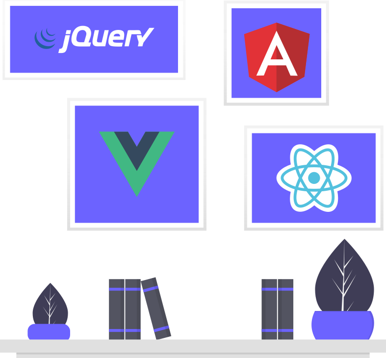

# Portfolio Project: HTML Concepts Documentation

This repository demonstrates essential HTML concepts and practices through a well-structured portfolio webpage. Below is the documentation outlining the key HTML concepts covered in this project.

## Table of Contents
1. [Document Structure](#1-document-structure)
2. [Metadata](#2-metadata)
3. [Semantic Elements](#3-semantic-elements)
4. [Links](#4-links)
5. [Images](#5-images)
6. [Lists](#6-lists)
7. [Headings and Text](#7-headings-and-text)
8. [Accessibility](#8-accessibility)
9. [Interactive Elements](#9-interactive-elements)
10. [Scripts](#10-scripts)
11. [Responsive Design](#11-responsive-design)

---

## 1. Document Structure
### Description:
The basic structure of an HTML document consists of the `<!DOCTYPE>` declaration, followed by the `<html>`, `<head>`, and `<body>` tags.

### Code Example:
```html
<!DOCTYPE html>
<html lang="en">
  <head>
    <meta charset="UTF-8">
    <meta name="viewport" content="width=device-width, initial-scale=1.0">
    <title>Portfolio</title>
  </head>
  <body>
    <!-- Content goes here -->
  </body>
</html>
```

---

## 2. Metadata
### Description:
Metadata provides information about the document. The `<meta>` tag is used for character encoding, responsive design, and SEO.

### Code Example:
```html
<meta charset="UTF-8">
<meta name="viewport" content="width=device-width, initial-scale=1.0">
```

- **`charset`**: Ensures correct display of special characters.
- **`viewport`**: Makes the page responsive for mobile devices.

---

## 3. Semantic Elements
### Description:
Semantic tags provide meaning to the content, improving accessibility and SEO.

### Tags Used:
- **`<header>`**: Represents introductory content like navigation.
- **`<section>`**: Groups related content.
- **`<footer>`**: Contains copyright or closing information.

### Code Example:
```html
<header class="navbar">
  <div class="logo">My Portfolio</div>
</header>
<section id="about">
  <h2>About Me</h2>
  <p>Hi, I’m Kuldeep, a passionate web developer.</p>
</section>
<footer>
  <p>&copy; 2024 All rights reserved.</p>
</footer>
```

---

## 4. Links
### Description:
Links are used to navigate between pages or sections and to include external resources like stylesheets and fonts.

### Code Example:
#### Navigation Links:
```html
<a href="#home">Home</a>
<a href="#contact">Contact</a>
```
#### External Resources:
```html
<link rel="stylesheet" href="./styles/index.css">
<link rel="preconnect" href="https://fonts.googleapis.com">
<link rel="stylesheet" href="https://fonts.googleapis.com/css2?family=Inter&display=swap">
```

---

## 5. Images
### Description:
The `` tag is used to embed images, with the `src` attribute specifying the file and `alt` providing a description for accessibility.

### Code Example:
```html

```

- **`alt`**: Provides a text alternative for images.
- **`width`**: Defines the image width in pixels.

---

## 6. Lists
### Description:
Lists structure items in a hierarchical format. Unordered lists (`<ul>`) are used for navigation menus.

### Code Example:
```html
<ul class="nav-links">
  <li><a href="#home">Home</a></li>
  <li><a href="#projects">Projects</a></li>
  <li><a href="#contact">Contact</a></li>
</ul>
```

---

## 7. Headings and Text
### Description:
Headings (`<h1>` to `<h6>`) structure content hierarchically, and inline tags like `<strong>` emphasize text.

### Code Example:
```html
<h1>Kuldeep Singh</h1>
<h2>About Me</h2>
<p>Hi, I’m <strong>Kuldeep</strong>, a passionate web developer.</p>
```

---

## 8. Accessibility
### Description:
Attributes like `alt` and `aria-label` improve accessibility for users with assistive technologies.

### Code Example:
```html

```

---

## 9. Interactive Elements
### Description:
Interactive elements like buttons and anchor tags provide user interactions.

### Code Example:
```html
<button aria-label="Toggle day/night mode">
  
</button>
```

---

## 10. Scripts
### Description:
The `<script>` tag is used to include JavaScript files for interactivity and functionality.

### Code Example:
```html
<script src="./scripts/portfolio.js"></script>
```

---

## 11. Responsive Design
### Description:
The `<meta name="viewport">` tag ensures the webpage is mobile-friendly by controlling the viewport’s scaling and layout.

### Code Example:
```html
<meta name="viewport" content="width=device-width, initial-scale=1.0">
```

---

## How to Use This Repository
1. Clone the repository:
   ```bash
   git clone https://github.com/kuldeep0753/Profile.git
   ```
2. Open the `index.html` file in your browser to view the portfolio webpage.
3. Refer to the documentation for learning HTML concepts.

---

<!-- CSS documentation -->

# CSS Documentation

This README outlines the key CSS concepts implemented in the code and serves as a reference for understanding the various styles applied.

---

## Concepts Covered

### 1. **Selectors and Specificity**
- Targets specific HTML elements for styling.
```css
body {
  margin: 0;
}
h1 > span {
  color: #391cbe;
}
```

### 2. **Typography**
- Customizes font styles, alignment, and colors.
```css
body {
  font-family: "Inter", sans-serif;
  color: #333;
}
h1, h2, h3 {
  text-align: center;
}
```

### 3. **Box Model**
- Manages margins, padding, borders, and shadows.
```css
.project {
  border: 1px solid #ddd;
  padding: 20px;
  box-shadow: 0 2px 5px rgba(0, 0, 0, 0.1);
}
```

### 4. **Flexbox**
- Enables flexible layouts and alignment.
```css
.navbar {
  display: flex;
  justify-content: space-between;
  align-items: center;
}
.projects {
  display: flex;
  flex-wrap: wrap;
  gap: 20px;
}
```

### 5. **Media Queries**
- Provides responsive styling for various screen sizes.
```css
@media (min-width: 600px) {
  .navbar {
    flex-direction: row;
  }
}
```

### 6. **Navigation Bar Styling**
- Sticky navbar with hover effects for links.
```css
.navbar {
  position: sticky;
  top: 0;
  background-color: #8c93e5;
  color: #fff;
}
.nav-links li a:hover {
  background-color: #575757;
}
```

### 7. **Transitions**
- Adds smooth effects for state changes.
```css
.nav-links li a {
  transition: background 0.3s;
}
```

### 8. **Responsive Design**
- Ensures proper layout on devices of different sizes.
```css
@media (min-width: 1024px) {
  .projects {
    gap: 30px;
    justify-content: center;
  }
}
```

### 9. **Colors and Backgrounds**
- Applies color schemes and background settings.
```css
body {
  background-color: white;
  color: #333;
}
.navbar {
  background-color: #8c93e5;
}
```

### 10. **Images**
- Ensures responsive and accessible image styling.
```css
.day-night {
  width: 100px;
  max-width: 40px;
}
```

### 11. **Footer Styling**
- Provides a consistent and styled footer.
```css
footer {
  text-align: center;
  padding: 10px;
  background-color: #8c93e5;
  color: #fff;
}
```

---

## Conclusion
The code demonstrates foundational CSS techniques, including typography, the box model, responsive design, Flexbox, and transitions. These concepts lay the groundwork for mastering CSS. Further exploration of Grid, animations, and custom properties is recommended for advanced styling.


<!-- Javascript Concepts -->
Here's a structured Git README documentation for your project, highlighting the concepts covered and what further needs to be completed:

---

# Project Documentation

## Overview

This project demonstrates various fundamental concepts of JavaScript and DOM manipulation. It includes features such as a dynamic day-night toggle, a responsive hamburger menu, and the rendering of project information dynamically based on an array. The code is designed to be interactive, with real-time updates based on user interactions, such as resizing the window and clicking buttons.

## Concepts Covered

### 1. **DOM Manipulation (25%)**
   - **What’s Covered**:
     - Selecting elements from the DOM using `document.querySelector()`.
     - Modifying the properties of selected elements such as `backgroundColor` and `color`.
     - Dynamically creating new elements with `document.createElement()` and appending them to the DOM with `appendChild()`.
   - **Example**: The toggle button dynamically changes the page's background color and text color between light and dark themes.

### 2. **Event Handling (25%)**
   - **What’s Covered**:
     - Attaching event listeners to DOM elements using `addEventListener()`.
     - Handling user interactions such as clicks and resizing events.
   - **Example**: The hamburger menu is shown/hidden based on the window width and user clicks.

### 3. **Conditional Logic (15%)**
   - **What’s Covered**:
     - Implementing `if-else` logic to dynamically update content or styles based on certain conditions.
   - **Example**: The day-night toggle uses `if-else` statements to switch between light and dark mode based on the background color.

### 4. **CSS Styling with JavaScript (15%)**
   - **What’s Covered**:
     - Directly manipulating styles of DOM elements (e.g., `backgroundColor`, `color`, `display`).
   - **Example**: The background and text color change dynamically when the day-night toggle button is clicked.

### 5. **Responsive Design (10%)**
   - **What’s Covered**:
     - Detecting window size changes using the `resize` event.
     - Adjusting visibility of elements based on screen width (e.g., showing/hiding the hamburger menu for mobile view).
   - **Example**: The navigation menu switches between a standard bar and a hamburger menu depending on the window width.

### 6. **Creating Dynamic Content (10%)**
   - **What’s Covered**:
     - Dynamically generating and displaying project information (e.g., titles, links, descriptions) using an array and a `forEach` loop.
   - **Example**: A list of projects is rendered dynamically based on an array of project objects.

## Further Concepts to Complete

While the above concepts are fundamental for understanding JavaScript and DOM manipulation, the following advanced topics are crucial for building more complex, performant, and scalable web applications.

### 1. **Asynchronous JavaScript**
   - **What to Learn**:
     - Using `async`/`await` and `Promises` to handle asynchronous code.
     - Making HTTP requests with `fetch` or `XMLHttpRequest` to interact with external APIs.
     - Error handling in asynchronous operations.

### 2. **JavaScript Frameworks and Libraries**
   - **What to Learn**:
     - Introduction to modern JavaScript frameworks like **React**, **Vue**, or **Angular**.
     - Understanding the concept of **component-based architecture**.
     - Using libraries like **jQuery** or **Axios** for handling complex tasks.

### 3. **State Management**
   - **What to Learn**:
     - State management techniques for handling large-scale applications.
     - Learn about **Redux**, **Context API** (in React), or other libraries to manage global state.

### 4. **JavaScript ES6+ Features**
   - **What to Learn**:
     - Advanced JavaScript features such as destructuring, template literals, arrow functions, and modules.
     - Learn how to use ES6 modules (`import/export`) for better code organization.

### 5. **Performance Optimization**
   - **What to Learn**:
     - Techniques to optimize web performance, such as **lazy loading**, **code splitting**, and **debouncing**.
     - Minimizing **reflows** and **repaints** for smoother UI updates.

### 6. **Testing**
   - **What to Learn**:
     - Testing methodologies, such as **unit testing** and **integration testing** using frameworks like **Jest** or **Mocha**.
     - Learn to write test cases for JavaScript functions, DOM interactions, and API calls.

## Conclusion

This project provides a solid foundation in core web development concepts, from DOM manipulation to handling responsive design and dynamic content. However, there is still room for improvement, especially in handling asynchronous operations, testing, and using modern JavaScript frameworks for building more robust applications.

